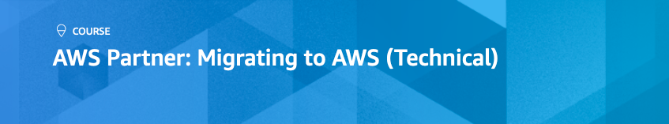
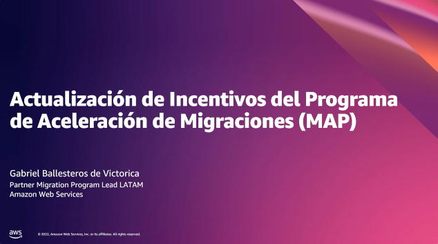

+++ 
title = "Recursos adicionales" 
weight = 30
chapter = true
pre = "<b>3. </b>"
+++

En esta sección encontrarás recursos no solo para fortalecer la práctica de Cloud Economics que recien has aprendido, sino ambién para iniciar el siguiente paso natural de nuestros clientes, como lo es Cloud Financial Management que nos servira para aconsejarlos en la mejor forma de gestionar, optimizar y planear los costos en AWS. Adicional encontrás recursos de mejores prácticas de nuestros especialistas para continuar ayudandote a fortalecer la práctica consultiva de Tú organización.

1. [Business Value]()

1. [Cloud Financial Management]()

1. [Migration Acceleration Program]()

### Entrenamiento para Partners

Inscríbase al entrenamiento <a href="https://kiku.aws.training/SessionSearch?pageNumber=1&courseId=23615&languageId=1" target="_blank">AWS Partner: Migrating to AWS (Technical)</a>

Inscríbase al entrenamiento <a href="https://kiku.aws.training/SessionSearch?pageNumber=1&courseId=16351&languageId=1" target="_blank">AWS Partner: Migrating to AWS (Business) (Classroom)</a>

Inscríbase al curso digital <a href="https://explore.skillbuilder.aws/learn/course/internal/view/elearning/12954/aws-cloud-economics-for-startups" target="_blank">Cloud Economics for Startups</a>

<a href=" https://attendee.gotowebinar.com/recording/3931553841237795587" target="_blank">Actualización de Incentivos del Programa de Aceleración de Migraciones (MAP)</a>

<a href=" https://attendee.gotowebinar.com/recording/3931553841237795587" target="_blank">Training de Assessment grabado (MRA, MPA, ME)</a>
