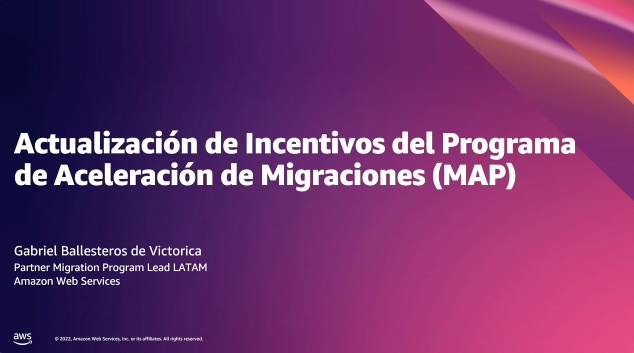

+++ 
title = "Recursos adicionais" 
weight = 30
chapter = true
pre = "<b>4. </b>"
+++

Nesta seção, você encontrará recursos não apenas para fortalecer a prática de economia da nuvem que acabou de aprender, mas também para iniciar a próxima etapa natural para nossos clientes, como o Cloud Financial Management, que nos ajudará a aconselhá-los sobre a melhor maneira de gerenciar, otimizar e planejar custos na AWS. Além disso, você encontrará recursos de melhores práticas de nossos especialistas para continuar ajudando você a fortalecer a prática consultiva de sua organização.

1. [Valor comercial]()

1. [Cloud Financial Management]()

1. [Programa de aceleração da migração]()

1. [Ferramentas]()

### Treinamento de parceiros

Inscreva-se para o treinamento <a href="https://explore.skillbuilder.aws/learn/course/view/elearning/2545/aws-partner-migrating-to-aws-technical-portuguese" target="_blank">AWS Partner: Migrating to AWS (Technical)</a>

Inscreva-se no curso digital <a href="https://explore.skillbuilder.aws/learn/course/view/elearning/16144/aws-cloud-economics-for-startups-portuguese" target="_blank">AWS Cloud Economics for Startups (Portuguese)</a>

<a href="https://attendee.gotowebinar.com/recording/3931553841237795587" target="_blank">Atualização de incentivos do programa de aceleração de migração (MAP)</a>